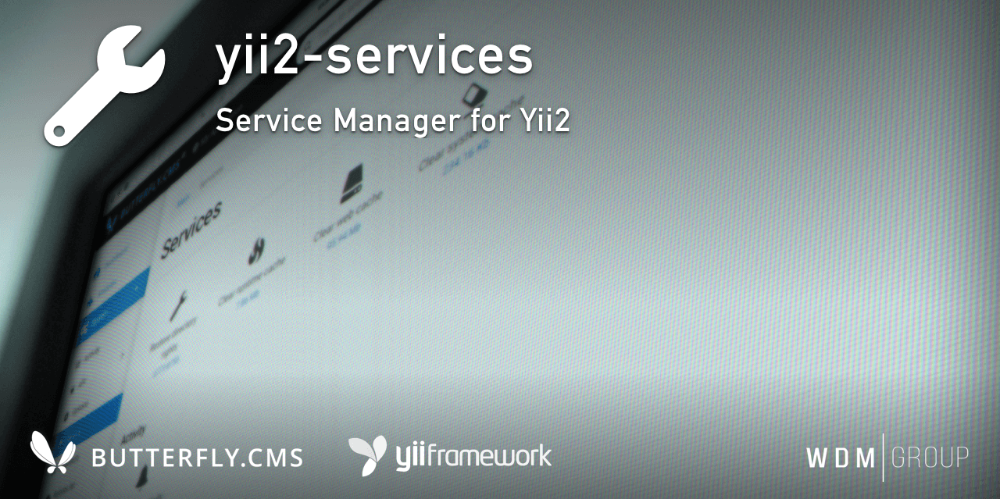

# Yii2 Services Module
System Service Manager for Yii2.

This module is an integral part of the [Butterfly.СMS](https://butterflycms.com/) content management system, but can also be used as an standalone extension.

Copyrights (c) 2019-2020 [W.D.M.Group, Ukraine](https://wdmg.com.ua/)

# Requirements 
* PHP 5.6 or higher
* Yii2 v.2.0.35 and newest
* [Yii2 Base](https://github.com/wdmg/yii2-base) module (required)
* [Yii2 Activity](https://github.com/wdmg/yii2-activity) module (support/optionaly)
* [Yii2 Stats](https://github.com/wdmg/yii2-stats) module (support/optionaly)
* [Yii2 Users](https://github.com/wdmg/yii2-users) module (support/optionaly)
* [Yii2 Mailer](https://github.com/wdmg/yii2-mailer) module (support/optionaly)
* [Yii2 API](https://github.com/wdmg/yii2-api) module (support/optionaly)
* [Yii2 Search](https://github.com/wdmg/yii2-search) module (support/optionaly)
* [Yii2 RSS](https://github.com/wdmg/yii2-rss) module (support/optionaly)
* [Yii2 Yandex.Turbo](https://github.com/wdmg/yii2-turbo) module (support/optionaly)
* [Yii2 Google AMP](https://github.com/wdmg/yii2-amp) module (support/optionaly)
* [Yii2 Sitemap](https://github.com/wdmg/yii2-sitemap) module (support/optionaly)

# Installation
To install the module, run the following command in the console:

`$ composer require "wdmg/yii2-services"`

After configure db connection, run the following command in the console:

`$ php yii services/init`

And select the operation you want to perform:
  1) Restore directory rights
  2) Clear runtime cache
  3) Clear web cache
  4) Clear the all system cache

# Configure
To add a module to the project, add the following data in your configuration file:

    'modules' => [
        ...
        'services' => [
            'class' => 'wdmg\services\Module',
            'routePrefix' => 'admin'
        ],
        ...
    ],

# Routing
Use the `Module::dashboardNavItems()` method of the module to generate a navigation items list for NavBar, like this:

    <?php
        echo Nav::widget([
        'options' => ['class' => 'navbar-nav navbar-right'],
            'label' => 'Modules',
            'items' => [
                Yii::$app->getModule('services')->dashboardNavItems(),
                ...
            ]
        ]);
    ?>

# Status and version [ready to use]
* v.1.1.12 - Update dependencies, README.md
* v.1.1.11 - Update README.md and dependencies
* v.1.1.10 - Added clearing for Google AMP, Yandex.Turbo, RSS-feed, Search and Sitemap modules
* v.1.1.9 - Fixed deprecated class declaration
* v.1.1.8 - Added clearing for Mailer module
* v.1.1.7 - Added extra options to composer.json and navbar menu icon